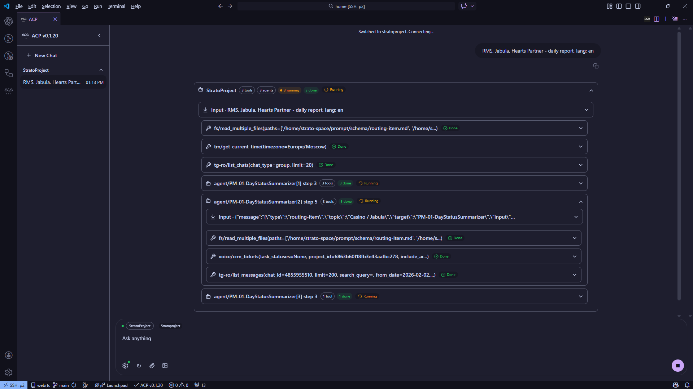

# ACP Plugin (VS Code Extension + Web UI)

ACP Plugin is a pragmatic client for the [Agent Client Protocol (ACP)](https://agentclientprotocol.com/get-started/introduction). It lets you run ACP-compatible coding agents from:

- VS Code (extension)
- Your browser (acp-chat, optional)

ACP is the protocol. ACP Plugin is the client (VS Code extension + optional web UI) in this repository.



## Agent Configuration

ACP Plugin intentionally follows the `agent_servers` format used by the *[Zed editor](https://zed.dev)*, so you can copy/paste agent definitions between Zed and ACP Plugin with minimal changes.

Note: `agent_servers` is a settings convention for describing how to spawn agent processes. It is not part of the ACP wire protocol.

Canonical references for `agent_servers`:

- Zed docs (External Agents): https://zed.dev/docs/ai/external-agents
- ACP Python SDK quickstart: https://github.com/agentclientprotocol/python-sdk/blob/main/docs/quickstart.md

Your agent settings are read from both VS Code global settings and Workspace `settings.json`.
In your current workspace setup, workspace settings are read from `/home/user/workspace/.vscode/settings.json`.
Built-in default agent presets are defined in repo file `src/acp/agents.ts`, bundled into the extension VSIX, and are not edited directly in the installed plugin files.
Parameter `acp.includeBuiltInAgents` (default `true`) defines whether these built-in presets are included alongside custom agents. For scalar settings, workspace values override global values.
If custom agents do not appear, check that your settings use `agent_servers` (or `acp.agents`). The legacy key `acp.agentServers` is deprecated and ignored by current builds.

### Pre-configured Agents

ACP Plugin ships with a set of built-in agent presets (you can override any of them by defining an agent with the same id in settings):

| ID | Name | Default command |
|----|------|-----------------|
| `codex` | Codex CLI | `npx --yes @zed-industries/codex-acp@latest` |
| `github-copilot` | GitHub Copilot | `npx --yes @github/copilot-language-server@latest --acp` |
| `claude-code` | Claude Code | `npx --yes @zed-industries/claude-code-acp@latest` |
| `gemini` | Gemini CLI | `npx --yes @google/gemini-cli@latest --experimental-acp` |
| `qwen-code` | Qwen Code | `npx --yes @qwen-code/qwen-code@latest --acp --experimental-skills` |
| `auggie` | Auggie CLI | `npx --yes @augmentcode/auggie@latest --acp` |
| `qoder` | Qoder CLI | `npx --yes @qoder-ai/qodercli@latest --acp` |
| `opencode` | OpenCode | `npx --yes opencode-ai@latest acp` |

Notes:

- These are just defaults, not endorsements. Some agents require separate auth/login steps.
- `npx` requires Node.js to be installed and accessible on `PATH` (especially important for Remote-SSH hosts).

### Quick Start (VS Code)

1. Install ACP Plugin (Marketplace or VSIX).
2. Open the ACP view in the Activity Bar (ACP icon), then click "Open Chat".
3. Pick an agent from Settings (gear icon), click Connect, and start chatting.

### Schema (Zed-Compatible)

Each agent entry is keyed by a stable agent id:

```jsonc
{
  "agent_servers": {
    "StratoProject": {
      "type": "custom",
      "name": "StratoProject",
      "command": "uv",
      "args": [
        "--directory",
        "${workspaceFolder}/app",
        "run",
        "--active",
        "StratoProject.py",
        "--transport",
        "acp"
      ],
      "cwd": "${workspaceFolder}",
      "env": {
        "PYTHONUNBUFFERED": "1"
      }
    }
  }
}
```

Supported fields:

- `command` (string, required): executable name or path (resolved from `PATH`)
- `args` (string[], optional): argv passed to the process
- `env` (object, optional): environment variables merged over the extension host environment
- `cwd` (string, optional): working directory for the agent process
- `name` (string, optional): display name (defaults to the key)
- `type` (string, optional): informational (kept for compatibility)

### Extension Settings

ACP Plugin keeps compatibility with upstream `formulahendry/vscode-acp` settings, while also supporting the `agent_servers` format used by the *[Zed editor](https://zed.dev)*.

| Setting | Default | Implemented Here | Description |
|---------|---------|------------------|-------------|
| `agent_servers` | `{}` | Yes | Main agent configuration (Zed editor compatible). `acp.agents` is supported as an alias for upstream compatibility (same shape). |
| `acp.includeBuiltInAgents` | `true` | Yes | Include built-in presets in the agent selector. |
| `acp.connectTimeoutMs` | `600000` | Yes | Max time to wait for ACP `initialize()` when connecting (ms). |
| `acp.autoApprovePermissions` | `ask` | Yes | How ACP permission requests are handled: `ask` prompts every time, `allowAll` approves everything. |
| `acp.defaultWorkingDirectory` | `""` | Yes | Default working directory for agent processes. Empty uses the current workspace folder. |
| `acp.logTraffic` | `true` | Yes | Log raw ACP JSON-RPC traffic to the `ACP Traffic` output channel. |

### Variable Expansion

These placeholders are expanded in `command`, `args`, and `cwd`:

- `${workspaceFolder}`
- `${userHome}`
- `${env:NAME}`

### One Small Ergonomic Hack: `--watch`

If a custom agent's `args` include ACP transport (`--transport acp` or `--transport=acp`), ACP Plugin automatically appends `--watch` (if missing).

Why:

- In `fast-agent`, `--watch` enables hot-reloading AgentCard changes.
- It is only applied when the agent explicitly opts into ACP transport, to avoid surprising behavior for other CLIs.

### Where Agent Config Is Read From

ACP Plugin merges agent definitions found in the following places (lowest priority first):

- `acp.agents` (supported alias for upstream `formulahendry/vscode-acp`)
- `agent_servers` (Zed-style, root)

Merge order is: global settings -> workspace settings -> workspace-folder settings.
If the same agent id appears multiple times, the higher-priority scope overrides the lower-priority one.

## What You Get

What makes this repo worth using (and for us, worth maintaining):

- A VS Code ACP client with a clean, fast chat UI (sessions, new chat, attachments, tool-call rendering)
- A shared UI package used by both VS Code and the web UI (`packages/acp-ui`)
- Zed editor compatible agent configuration (`agent_servers`) so teams can standardize on one format
- A practical bridge toward an "open agent stack": ACP for clients + MCP for tools + portable agent definitions

## Design Goals

From a strong concept to an enterprise-ready platform:

- Support user-defined agents, not only default presets.
- ACP-first implementation with support for the latest protocol features.
- Active release cadence for fast delivery.
- Deep integration with `fast-agent.ai`.
- Stress testing, including massive parallel agent calls.
- Ongoing adoption of modern assistant UI capabilities from `assistant-ui`: https://github.com/assistant-ui/assistant-ui
- Significant increase in automated test coverage.

## Concepts: ACP vs MCP (Why Both Matter)

- ACP is the "client protocol": editors and UIs use it to talk to agents (connect, chat, tool calls, session updates).
- MCP is the "tool protocol": agents use it to talk to external tools and services (files, web, DBs, issue trackers, etc.).

In practice: ACP makes agents usable in IDEs; MCP makes agents useful in real systems. They complement each other.

## Repository Layout

This is a monorepo:

- VS Code extension: `src/` (entrypoint: `src/extension.ts`)
- Shared React UI: `packages/acp-ui/` (used by the extension webview and `acp-chat`)
- Web UI + server bridge: `acp-chat/`

## Installation

### Install From Marketplace

- Install from the VS Code Extensions view (search for **ACP Plugin**), or:

```bash
code --install-extension strato-space.acp-plugin
```

### Install From VSIX (Local)

```bash
npm ci
npm run package
npx vsce package --no-dependencies
code --install-extension ./acp-plugin-<version>.vsix --force
```

### Install Over Remote-SSH

VS Code Server sometimes requires routing the CLI through an IPC socket:

```bash
VSIX=./acp-plugin-<version>.vsix

for s in /run/user/$(id -u)/vscode-ipc-*.sock; do
  echo "Trying $s"
  VSCODE_IPC_HOOK_CLI="$s" code --install-extension "$VSIX" --force && break
done
```

## VS Code Commands

Useful commands (Command Palette):

- `ACP: Open ACP Chat`
- `ACP: New Chat`
- `ACP: Clear Chat`
- `ACP: New Chat Window`
- `ACP: Send to ACP Chat` (from the editor context menu / explorer)

## Web UI (acp-chat)

`acp-chat` serves a browser UI plus a WebSocket bridge that spawns an ACP agent per connection.

### Run Locally

```bash
cd acp-chat
npm ci
npm run build

ACP_CHAT_HOST=127.0.0.1 ACP_CHAT_PORT=8732 ACP_CHAT_AUTH_TOKEN=devtoken \
  npm run start
```

Open:

- `http://127.0.0.1:8732/?token=devtoken`

### Deploy (nginx + systemd)

Templates live in:

- `acp-chat/deploy/nginx/agents-dev.conf`
- `acp-chat/deploy/systemd/acp-chat.service`

Runtime env vars used by the server:

- `ACP_CHAT_HOST` (default `127.0.0.1`)
- `ACP_CHAT_PORT` (default `8732`)
- `ACP_CHAT_AUTH_TOKEN` (recommended; requires `?token=...` or `Authorization: Bearer <token>` for `/ws`)
- `ACP_CONNECT_TIMEOUT_MS` (default `600000`)
- `ACP_APP_VERSION` / `ACP_CHAT_VERSION` (optional override; otherwise uses repo `package.json` version)

Security note:

- `acp-chat` can spawn processes. Do not expose it to the internet without auth and network controls.

## Development

Prereqs:

- Node.js (this extension targets VS Code's Node runtime; the repo itself currently uses Node >= 20)

Dev loop:

```bash
npm ci
npm run watch
```

Then use "Run Extension" from `.vscode/launch.json`.

## Tests

Extension host tests:

```bash
npm test
```

Playwright smoke (agents-dev web):

```bash
ACP_AGENTS_DEV_TOKEN=... npm run test:e2e
```

Optional: VS Code smoke (Electron):

```bash
ACP_E2E_RUN_VSCODE=1 npm run test:e2e
```

Manual MCP runbook (for LLM-driven UI checks):

- `e2e/mode-b-mcp.md`

## Troubleshooting

### "Agent process exited immediately"

- Check the `command` exists on `PATH` (especially on Remote-SSH).
- If you're using `npx`, ensure Node.js is installed on the host.
- Run the command manually in a terminal to see the real error output.

### "ACP initialize() timed out"

- Increase `acp.connectTimeoutMs`.
- Some agents take a long time on first run because `npx` is downloading packages.

### Remote-SSH: extension installs but agents do not run

- Remember that the agent process runs on the remote host, not your laptop.
- Verify Node/npm availability on the remote host if you're relying on built-in `npx` agents.

## Contributing

Contributions that improve real-world usability are welcome:

- add or polish presets
- make the config story clearer and more compatible
- improve the UI/UX around sessions and tool calls
- improve debugging and error messages

Please include reproduction steps, logs, and screenshots when filing issues.

## Roadmap

High-impact next steps (PRs welcome):

- Agent config UX: validate `agent_servers` entries and surface actionable errors (bad `command`, missing args, invalid env).
- Diagnostics: make agent startup failures debuggable (stderr preview, resolved command/args/cwd/env, one-click "copy debug bundle").
- Registry flow: browse ACP agent registries and one-click add presets to `agent_servers`.
- Permissions: finer-grained policies than `ask` vs `allowAll` (per-tool and per-agent).

## License

Apache 2.0. See `LICENSE`.

## Acknowledgements and Why This Fork Exists

This repository started as an extraction/fork of `cosmos-vibe/Nexus-acp` (Nexus ACP extension).

We forked it to:

- Rebrand around ACP and use the `acp.*` configuration namespace
- Evolve the UI/UX independently (including the standalone `acp-chat` web UI)
- Stay compatible with the `agent_servers` config format used by the *[Zed editor](https://zed.dev)* and the wider ACP tooling ecosystem

Upstream attribution / prior art:

- `cosmos-vibe/Nexus-acp`
- `omercnet/vscode-acp`
- `formulahendry/vscode-acp`
- `zed` (agent_servers format; ACP agent CLIs like `@zed-industries/claude-code-acp` / `@zed-industries/codex-acp`)

Open agent platforms converge on shared primitives. The stack we aim to make practical:

- **ACP, MCP, AgentCard, SKILLS, True REPL** + **Building Effective Agents** in the box
- **ACP**: [Agent Client Protocol](<https://agentclientprotocol.com/get-started/introduction>)
- **MCP**: [Model Context Protocol](<https://modelcontextprotocol.io>)
- **AgentCard**: [AgentCard at the Summit: The Multi-Agent Standardization Revolution](<https://github.com/evalstate/fast-agent/blob/main/plan/agentcard-standards-mini-article.md>)
- **SKILLS**: <https://github.com/anthropics/skills>
- **True REPL**: run → observe → self-reflect → evolve → run again
- **Anthropic's Workflow Definitions**: [Building Effective Agents](<https://www.anthropic.com/engineering/building-effective-agents>)

Related reading:

- From Proprietary `call` platform to `fast-agent.ai`: Lessons in Open Agent Platforms (<https://github.com/strato-space/call>, see `docs/lessons-in-open-agent-platforms.md`)
